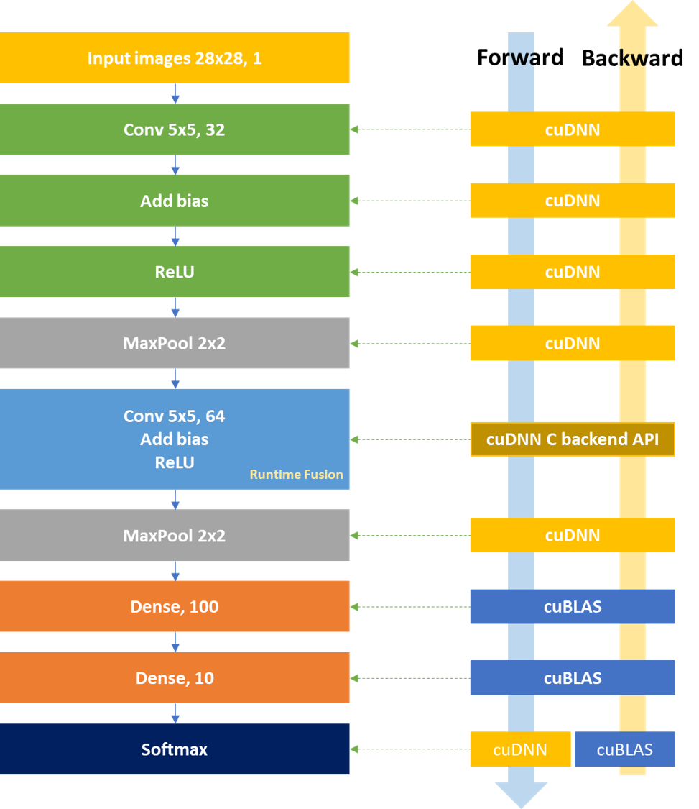

# cuDNN implementation with MNIST dataset

Implementing convolutional neural network using [cuDNN](https://www.tensorflow.org/datasets/catalog/mnist) with [C backend APIs](https://docs.nvidia.com/deeplearning/cudnn/api/index.html#cudnn-backend-api)(which was newly introduced from cuDNN version 8.x), and [cuBLAS](https://docs.nvidia.com/cuda/cublas/index.html) libraries for [MNIST dataset](https://www.tensorflow.org/datasets/catalog/mnist).
It's mainly focused on how to use cuDNN/cuBLAS libraries to design convolutional neural network models as an **educational purpose**. So, most of the codes are quite static and unregularized.
Please note that some optimization techniques must be additionally considered for practical usage.

## Version and enviornment
This implementation is written in the NGC container **PyTorch:22.10-py3** where the versions of CUDA libraries are:
- CUDA: 11.8
- CUDNN: 8.6
- CUBLAS: 11.11
- CMake: 3.22.2

respectively on **NVIDIA Volta V100 GPU**. Please make sure the right device value of `CMAKE_CUDA_ARCHITECTURES`. It must be specified when executing `cmake` command.

## Architecture
Basic Convolutional neural network architecture is considered(two Convolution layers with Bias, two ReLU, Pooling, Dense layers, and one Softmax layer). Details are shown in the below picture. 

<p align="center"></img></p>

Most of layers are implemented using the cuDNN library. Note that the second Convolutional block is intentionally implemented using the **cuDNN C backend API** for testing runtime fusion(i.e., fused kernel). From cuDNN 8.0, the [graph API](https://docs.nvidia.com/deeplearning/cudnn/developer-guide/index.html#op-fusion) was introduced with support of **operation fusion**. According to the documentation, the graph API has two entry points. The one is the C backend API, and the other one is the [C++ frontend API](https://github.com/NVIDIA/cudnn-frontend), which is more abstract and convenient header-only library on top of the C Backend API. If you could understand how to use the C backend API, then it would be much easier for you to use C++ frontend API. Dense layers are implemented using the cuBLAS library. Finally, the Softmax layer is implemented using both cuDNN and cuBLAS libraries for Forward and Backward pass respectively.


## Execution
1. Run NGC container
    ```sh
    $ docker run --gpus all -it --rm nvcr.io/nvidia/pytorch:22.10-py3
    ```
2. Clone the repository
    ```sh
    $ git clone https://github.com/woojinsoh/cudnn_mnist.git
    ```

3. Download the MNIST dataset
    ```sh
    $ cd cudnn_mnist 
    $ sh download_mnist.sh
    ```
4. Build the code
    ```sh
    $ mkdir -p build
    $ cd build 
    $ cmake -DSM={your SM number} ..
    $ make
    ```
5. Run
    ```sh
    $ ./bin/run_mnist
    ```

## Output
```
[Data Loading]
Load MNIST images from ../dataset/train-images-idx3-ubyte
>> Num Images:: 60000
>> Image Size:: 28 x 28
Load MNIST labels from ../dataset/train-labels-idx1-ubyte
>> Num Labels:: 60000
MNIST dataset is successfully loaded.

[Weight Initialization]
   >> [conv1_and_bias] weights and biases are initialized.
   >> [conv2_and_bias_and_relu] weights and biases are initialized.
   >> [dense1_and_bias] weights and biases are initialized.
   >> [dense2_and_bias] weights and biases are initialized.

[Model Architecture]
FWD:: [Layer Name:: conv1_and_bias]
>> Convolution input shape:: 128 x 1 x 28 x 28
>> Convolution output shape:: 128 x 32 x 24 x 24

>> Searching for the fastest convolution algorithm ... 
   >> FWD algorithm
   ===== CUDNN_STATUS_SUCCESS for Algo 1: -1.000000 time requiring 7808 memory
   ===== CUDNN_STATUS_SUCCESS for Algo 0: -1.000000 time requiring 0 memory
   ===== CUDNN_STATUS_SUCCESS for Algo 2: -1.000000 time requiring 7372800 memory
   ===== CUDNN_STATUS_SUCCESS for Algo 5: -1.000000 time requiring 18522112 memory
   ===== CUDNN_STATUS_SUCCESS for Algo 4: -1.000000 time requiring 35654784 memory
   ===== CUDNN_STATUS_SUCCESS for Algo 7: -1.000000 time requiring 25720448 memory
   ===== CUDNN_STATUS_NOT_SUPPORTED for Algo 6: -1.000000 time requiring 0 memory
   ===== CUDNN_STATUS_NOT_SUPPORTED for Algo 3: -1.000000 time requiring 0 memory
   >> Fastest FWD algorithm:: Algo 1
   >> Memory buffer size required:: 7808

   >> BWD Filter algorithm
   ===== CUDNN_STATUS_SUCCESS for Algo 0: -1.000000 time requiring 0 memory
   ===== CUDNN_STATUS_SUCCESS for Algo 3: -1.000000 time requiring 0 memory
   ===== CUDNN_STATUS_SUCCESS for Algo 5: -1.000000 time requiring 25720448 memory
   ===== CUDNN_STATUS_SUCCESS for Algo 1: -1.000000 time requiring 9363 memory
   ===== CUDNN_STATUS_SUCCESS for Algo 2: -1.000000 time requiring 46202880 memory
   ===== CUDNN_STATUS_NOT_SUPPORTED for Algo 6: -1.000000 time requiring 0 memory
   ===== CUDNN_STATUS_NOT_SUPPORTED for Algo 4: -1.000000 time requiring 0 memory
   >> Fastest BWD Filter algorithm:: Algo 0
   >> Memory Buffer size required:: 0

   >> BWD Data algorithm
   ===== CUDNN_STATUS_SUCCESS for Algo 0: -1.000000 time requiring 0 memory
   ===== CUDNN_STATUS_SUCCESS for Algo 2: -1.000000 time requiring 35933312 memory
   ===== CUDNN_STATUS_SUCCESS for Algo 3: -1.000000 time requiring 18522112 memory
   ===== CUDNN_STATUS_SUCCESS for Algo 5: -1.000000 time requiring 45708416 memory
   ===== CUDNN_STATUS_SUCCESS for Algo 1: -1.000000 time requiring 0 memory
   ===== CUDNN_STATUS_NOT_SUPPORTED for Algo 4: -1.000000 time requiring 0 memory
   >> Fastest Bwd Data Algorithm:: Algo 0
   >> Memory Buffer size required:: 0

FWD:: [Layer Name:: act1_relu]
>> Activation input shape:: 128 x 32 x 24 x 24
>> Activation output shape:: 128 x 32 x 24 x 24

FWD:: [Layer Name:: pool1_max]
>> Pooling input shape:: 128 x 32 x 24 x 24
>> Pooling output shape:: 128 x 32 x 12 x 12

Backend API fused kernel FWD:: [Layer Name:: conv2_and_bias_and_relu]
>> Input layout conversion:: from NCHW to NHWC.
>> Copy inputs:: from FP32 to FP16.
>> Copy weights/biases:: from FP32 to FP16.
>> Convolution input shape(NHWC):: 128 x 12 x 12 x 32
>> Convolution output shape(NHWC):: 128 x 8 x 8 x 64
>> BiasAdd output shape(NHWC):: 128 x 8 x 8 x 64
>> Activation output shape(NHWC):: 128 x 8 x 8 x 64
>> Conv/Bias/Activation Done:: with FP16

>> Copy outputs:: from FP16 to FP32
>> Output layout conversion:: from NHWC to NCHW
>> Activation output shape(NCHW):: 128 x 64 x 8 x 8

FWD:: [Layer Name:: pool2_max]
>> Pooling input shape:: 128 x 64 x 8 x 8
>> Pooling output shape:: 128 x 64 x 4 x 4

FWD:: [Layer Name:: dense1_and_bias]
>> Dense input shape:: 128 x 1024
>> Dense output shape:: 128 x 100

FWD:: [Layer Name:: dense2_and_bias]
>> Dense input shape:: 128 x 100
>> Dense output shape:: 128 x 10

FWD:: [Layer Name:: softmax]
>> Softmax input shape:: 128 x 10
>> Softmax output shape:: 128 x 10

[Start training]
Num iterations:: 2000
Batch size:: 128
At iteration    0,    Expected Loss:: 3.5131    Accuracy to the current batch:: 0.0469
At iteration  100,    Expected Loss:: 1.5796    Accuracy to the current batch:: 0.5156
At iteration  200,    Expected Loss:: 0.9891    Accuracy to the current batch:: 0.7344
At iteration  300,    Expected Loss:: 0.7754    Accuracy to the current batch:: 0.8203
At iteration  400,    Expected Loss:: 0.7836    Accuracy to the current batch:: 0.7812
At iteration  500,    Expected Loss:: 0.6714    Accuracy to the current batch:: 0.8125
At iteration  600,    Expected Loss:: 0.8184    Accuracy to the current batch:: 0.7734
At iteration  700,    Expected Loss:: 0.5289    Accuracy to the current batch:: 0.8516
At iteration  800,    Expected Loss:: 0.5872    Accuracy to the current batch:: 0.8516
At iteration  900,    Expected Loss:: 0.3770    Accuracy to the current batch:: 0.9141
At iteration 1000,    Expected Loss:: 0.4165    Accuracy to the current batch:: 0.8750
At iteration 1100,    Expected Loss:: 0.5315    Accuracy to the current batch:: 0.8281
At iteration 1200,    Expected Loss:: 0.2988    Accuracy to the current batch:: 0.9375
At iteration 1300,    Expected Loss:: 0.5029    Accuracy to the current batch:: 0.8359
At iteration 1400,    Expected Loss:: 0.1487    Accuracy to the current batch:: 0.9688
At iteration 1500,    Expected Loss:: 0.2985    Accuracy to the current batch:: 0.9297
At iteration 1600,    Expected Loss:: 0.4961    Accuracy to the current batch:: 0.8750
At iteration 1700,    Expected Loss:: 0.3613    Accuracy to the current batch:: 0.9062
At iteration 1800,    Expected Loss:: 0.6173    Accuracy to the current batch:: 0.8125
At iteration 1900,    Expected Loss:: 0.2433    Accuracy to the current batch:: 0.9688

[Load test dataset]
Load MNIST images from ../dataset/t10k-images-idx3-ubyte
>> Num Images:: 10000
>> Image Size:: 28 x 28
Load MNIST labels from ../dataset/t10k-labels-idx1-ubyte
>> Num Labels:: 10000
MNIST dataset is successfully loaded.

[Start inferencing]
9984 images are used for inference.
Total inference accuracy:: 0.9126

[Finished]
```
